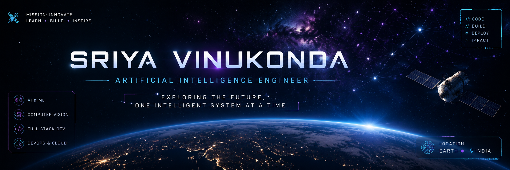

# Hey Explorers! ✨
<p align="center">
  
</p>


<p align="center">

</p>


# 🛰️ Mission Control

```yaml
Commander: Sriya Vinukonda

Mission:
Designing intelligent systems that solve real-world challenges.

Current Objectives:
  - Build Agentic AI Applications
  - Develop End-to-End ML Systems
  - Explore Computer Vision
  - Master DevOps & Cloud

Current Status:
🟢 Online

Mission Progress:
████████░░ 80%

Next Destination:
Agentic Artificial Intelligence 🚀
```
# 🛠️ Spacecraft Systems

<p align="center">
  
  
  
  
  
  
  
  
  
  
  
  
</p>

# 🚀 Current Missions

<table>
<tr>
<td width="33%" align="center">

### 🌐 UPI VoicePay
**Voice-Based UPI for the Visually Impaired**

🎙️ Voice Commands  
🔐 Voice Biometrics  
💳 UPI Integration

</td>

<td width="33%" align="center">

### 👗 Fashion Recommendation
**AI Outfit Recommendation System**

🧠 AI Recommendations  
📷 Computer Vision  
⚡ FastAPI + React

</td>

<td width="33%" align="center">

### ♻️ Smart Waste Segregation
**AI-Based Waste Classification**

📹 Computer Vision  
🤖 YOLO  
♻️ Smart Recycling

</td>

</tr>
</table>

## 📊 Mission Statistics

<p align="center">
  
  
</p>
